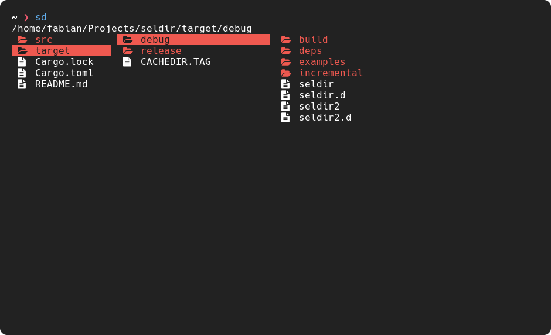

# seldir
A directory selection tui written in Rust



## key-bindings
- hjkl: leave, up, down, enter
- q/enter: quit and cd to directory
- esc: quit
- g: go to top
- G: go to bottom
- f: find forwards
- F: find backwards

## shell integration
To change the current directory of the shell you need a wrapper around seldir
Add the seldir binary to `$PATH` by placing it in `~/.cargo/bin`

### fish
```fish
function sd
    seldir --icons --color red $argv
    cd (cat /tmp/seldir)
end
```

### bash/zsh
```bash
function sd {
    seldir --icons --color red $@
    cd $(cat /tmp/seldir)
}
```
